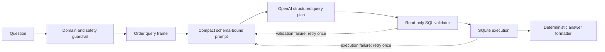

# OrderIQ architecture

[Back to README](README.md)

This document is the map of the implemented system: runtime boundaries, data
ownership, trust boundaries, and the decisions that shaped the solution. Module
internals and the future 50-tenant design are linked rather than repeated here.

## Scope

OrderIQ has one long-running Spring Boot service and one finite ETL application.
The two Gradle modules share Java contracts and a configured SQLite database;
they do not communicate over HTTP.

- `order-data` reads and normalizes CSV files, replaces the SQLite dataset, and
  exits.
- `order-ai` exposes the REST API, natural-language query workflow, and semantic
  search.
- The current SQLite and in-memory-vector choices are deliberately scoped to the
  exercise. The enterprise target is documented separately.

## System context and containers

```mermaid
flowchart TB
    Caller["API caller"] --> API["order-ai\nSpring Boot API"]
    CSV["Order CSV files"] --> ETL["order-data\nETL application"]

    ETL --> DB["SQLite\norders + dataset revision"]
    API --> DB
    API --> OpenAI["OpenAI API\nSQL query planning"]
    API -->|"embed query"| MiniLM["Local all-MiniLM-L6-v2\nquery and order embeddings"]
    API -->|"cosine search"| Index["Immutable in-memory\nsemantic index"]
    DB -. "revision changed" .-> Rebuild["Background index rebuild"]
    Rebuild -->|"embed order batches"| MiniLM
    Rebuild -->|"atomic snapshot swap"| Index
```

| Component | Responsibility | Lifecycle and boundary |
| --- | --- | --- |
| `order-data` | CSV extraction, normalization, fixed-rate conversion, validation, and atomic load | Finite process; Kubernetes Job in the container deployment |
| `order-ai` | REST controllers, guardrails, LLM orchestration, SQL execution, answer formatting, and semantic search | Only long-running microservice; Kubernetes Deployment |
| SQLite | Normalized orders and dataset revision | Persistent exercise store; shared through one configured path |
| OpenAI | Produce a structured SQL query plan from a bounded question and schema | External cloud API; generated SQL is treated as untrusted |
| MiniLM | Produce local 384-dimensional embeddings | Runs inside `order-ai`; no order rows leave the process for embedding |
| Semantic index | Cosine search over the active order-vector snapshot | Immutable in-memory snapshot replaced atomically |

## Runtime flows

### CSV ingestion

1. The CLI receives `load` and one or more CSV paths.
2. CSV structure is validated before persistence changes begin.
3. Each row is normalized independently; defaults and rejections are reported.
4. Valid orders replace the previous dataset in one SQLite transaction.
5. The dataset revision advances in the same transaction.
6. The ETL prints its report and exits.

### Exact REST queries

Customer, statistics, and recent-order endpoints call `OrderQueryService`, which
uses parameterized SQLite repositories. These endpoints do not call an LLM.

### Natural-language-to-SQL

The LLM receives the question and four-column schema, not order rows. Every plan
must be one read-only query. Validation or execution failure permits one
correction attempt; a second failure terminates the request.

### Semantic search and refresh

The API embeds an admitted query locally and searches the current immutable
snapshot by cosine similarity. The ETL and API may run in separate JVMs, so the
API polls the SQLite dataset revision. A revision change starts a background
batch rebuild; the old snapshot remains available until the replacement is
complete and atomically installed.

## Data ownership

| Data | Owner | Notes |
| --- | --- | --- |
| `orders` | `order-data` writes; `order-ai` reads | `order_id`, `customer_id`, ISO `order_date`, canonical `amount_usd` |
| `order_dataset_state` | `order-data` advances; `order-ai` observes | Cross-process semantic-index refresh signal |
| Embedding model cache | `order-ai` | Stored under the configured cache directory or persistent volume |
| Active vectors | `order-ai` | Process-local immutable snapshot; rebuilt from SQLite |

## Deployment boundary

One multi-stage image contains both executable JARs. The default entry point
runs `order-ai`; the Kubernetes Job overrides it to run `order-data`. Both mount
the same persistent volume. The exercise uses one API replica and `Recreate`
because shared SQLite is not presented as horizontally scalable storage.

See [deployment](docs/deployment.md) for commands and manifest details.

## Security and trust boundaries

- User questions are untrusted and pass through length, domain, content, and
  prompt-injection checks.
- LLM output is untrusted and passes through structured-plan and read-only SQL
  validation before SQLite access.
- The model receives only the minimum schema and question; answer formatting is
  local.
- Secrets come from environment variables or a Kubernetes Secret, never a
  ConfigMap or repository file.
- The container runs as a non-root user with Linux capabilities dropped.
- Operational logs contain the exercise-required prompt, SQL, and token usage.
  A production deployment would redact PII and log a prompt-template version.

Authentication, authorization, TLS termination, and database encryption are not
implemented because they are outside the exercise scope. They are mandatory
before exposing the service to enterprise traffic.

## Key decisions and accepted trade-offs

| Decision | Why | Accepted trade-off |
| --- | --- | --- |
| One API service plus one ETL job | Preserves a real runtime boundary without inventing internal network calls | Modules cannot scale independently as two online services |
| SQLite for the exercise | Simple, portable, and sufficient for the supplied dataset | One writer and one API replica; not the enterprise database |
| Deterministic guardrail before OpenAI | Rejects common invalid input without token cost | Vocabulary rules do not replace full semantic reasoning |
| Local deterministic answer formatting | Avoids a second LLM call and keeps numeric answers stable | Wording is intentionally simple |
| In-memory vector scan | Predictable for roughly 5,000 compact vectors | Requires replacement at higher tenant or data scale |
| Immutable index swap | Keeps in-flight searches available during rebuild | Temporarily holds old and new snapshots in memory |

## Evolution triggers

| Trigger | Evolution |
| --- | --- |
| Concurrent writes or multiple API replicas | Replace SQLite with a managed relational database |
| Larger order volumes or strict tenant isolation | Move to tenant-scoped vector collections in a vector store |
| Multiple residency regions | Route tenants to data-resident cells |
| Per-tenant model policy | Add a regional model gateway with cloud and on-premise adapters |
| Production exposure | Add identity, authorization, TLS, audit retention, rate limiting, and managed secrets |

The required one-page enterprise design is in
[Part 4d — scaling to 50 enterprise customers](docs/enterprise-architecture.md).

## Documentation map

- [Getting started](docs/getting-started.md)
- [API reference](docs/api-reference.md)
- [Deployment](docs/deployment.md)
- [Data module](docs/data-module.md)
- [AI module](docs/ai-module.md)
- [Part 4d enterprise design](docs/enterprise-architecture.md)

## Glossary

| Term | Meaning |
| --- | --- |
| ETL | Extract, transform, and load the supplied order data |
| NL-to-SQL | Converting a natural-language order question into validated SQL |
| Query plan | Structured model response containing `QUERY` or `REJECTED`, SQL, and reason |
| Semantic index | Order embeddings searched by cosine similarity |
| Residency cell | Regional boundary containing tenant data and enforcing approved model egress |
