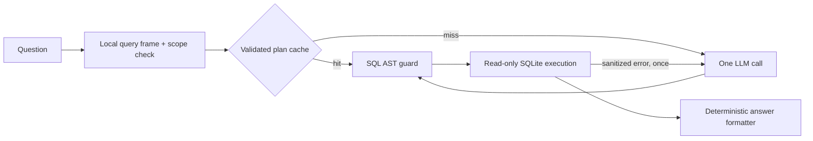

# AI module

## Responsibility

`order-ai` is the executable and API boundary. It will own the REST controllers,
the natural-language query orchestration, semantic search, and API-specific
security and observability. It calls `order-data` through in-process Java ports.

This is a bounded query agent, not an autonomous general-purpose agent. Adding
LangGraph or another agent framework is unnecessary for the required path; an
explicit Java state machine is easier to test and satisfies the one-retry rule.

## Natural-language query flow

1. Accept the question and enforce length, character, and request-rate limits.
2. Redact or tokenize unnecessary identifiers before any external model call.
3. Build a small query frame locally: requested metric, filters, time window,
   grouping, and requested result shape.
4. Reject questions whose concepts are outside the order schema before paying
   for an LLM call.
5. Check a tenant/model/schema-version-aware semantic cache. A safe cache hit
   reuses a previously validated query plan.
6. On a cache miss, call the generative model once with the question, compact
   `orders` schema, SQLite dialect, read-only rules, and structured-output
   contract. This is where the LLM is called for NL-to-SQL.
7. Parse the model output and validate the SQL structurally: exactly one
   `SELECT`, allow-listed table and columns, no comments, no DDL/DML/PRAGMA,
   bounded row count, and a database timeout.
8. Execute through a read-only database connection. If parsing or execution
   fails, call the model once more with only the original compact context and a
   sanitized error. There is no third attempt.
9. Render the answer deterministically from typed result rows. A second LLM call
   is not needed merely to turn a number into a sentence.
10. Return `answer`, `sql_used`, and `rows`; record latency, model, token usage,
    retry outcome, and a redacted prompt fingerprint.

### Why this is token- and cost-conscious

- The stable system prompt and four-column schema are compact and cacheable by
  providers that support prompt-prefix caching.
- Deterministic scope checks reject impossible questions without an LLM.
- Validated plans are cached by normalized question, schema version, model, and
  tenant; raw result rows are not shared across tenants.
- The model produces structured output once. SQL validation and answer wording
  are local.
- The expensive retry happens only after a concrete validation/runtime error.
- Token ceilings and a small routing model are configuration, not hard-coded
  provider assumptions.

The exercise explicitly requires logging the prompt. Development mode can log
the complete prompt for demonstration; production mode should log the template
version, redacted prompt, and cryptographic fingerprint so PII is not copied into
the logging system.

## Semantic search flow

The embedding model is separate from the generative LLM. At startup it converts
each order into a short canonical sentence and builds an in-memory cosine index.
Queries use the same model. On `OrdersReloadedEvent`, a background worker builds
a complete replacement index and atomically swaps the active reference, so
in-flight searches continue using the old immutable index.

For the small exercise dataset, an in-memory Java vector matrix is sufficient
and makes tenant filtering easy to reason about. The enterprise design replaces
it with a per-tenant vector collection inside the tenant's residency cell.
