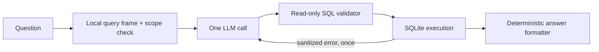

# AI module

## Responsibility

`order-ai` is the executable and API boundary. It owns the REST controllers,
natural-language query orchestration, and API-specific security and
observability. It calls `order-data` through in-process Java interfaces.
It also owns the local embedding model and in-memory semantic order index.

This is a bounded query agent, not an autonomous general-purpose agent. Adding
LangGraph or another agent framework is unnecessary for the required path; an
explicit Java state machine is easier to test and satisfies the one-retry rule.

## Natural-language query flow

1. Validate the request length and run the deterministic order-domain guardrail.
2. Build a query frame containing the original question and locally extracted
   order concepts.
3. Reject unsafe, out-of-domain, and unavailable-schema questions before paying
   for an LLM call when they can be identified locally.
4. Call OpenAI once with the question, compact `orders` schema, SQLite dialect,
   read-only rules, and structured-output contract.
5. Accept either a structured `QUERY` plan or a `REJECTED` plan. A rejection
   becomes HTTP `400` and never reaches SQLite.
6. Validate generated SQL as one read-only `SELECT`/`WITH` statement with no
   comments, DDL/DML/PRAGMA, internal SQLite tables, or additional statements.
7. Execute the validated SQL against SQLite. If validation or execution fails,
   call the model once more with the failed SQL and a bounded, single-line error.
   The corrected SQL is validated and executed once; there is no third attempt.
8. Render the answer deterministically from result rows. A separate LLM call is
   not needed merely to turn database values into a sentence.
9. Return `answer`, `sql_used`, and `rows`; log the prompt, query plan, and token
   usage for each model call.

### Why this is token- and cost-conscious

- The stable system prompt and four-column schema are compact and cacheable by
  providers that support prompt-prefix caching.
- Deterministic scope checks reject impossible questions without an LLM.
- The model produces structured output once. SQL validation and answer wording
  are local.
- The expensive retry happens only after a concrete validation/runtime error.
- The model identifier is configuration rather than a hard-coded provider
  assumption, allowing representative quality, cost, and latency evaluation.

A validated query-plan cache is a future optimization, not part of the current
exercise implementation. It would require schema-version and tenant-aware cache
keys before being safe for enterprise use.

The exercise explicitly requires logging the prompt. Development mode can log
the complete prompt for demonstration; production mode should log the template
version, redacted prompt, and cryptographic fingerprint so PII is not copied into
the logging system.

## Semantic search flow

The embedding model is separate from the generative LLM. At startup the local
`all-MiniLM-L6-v2` ONNX model converts each order into a short canonical sentence
and builds an in-memory cosine index. The sentence includes data-relative value
and recency labels, including a compound label for high-value recent orders.
Queries use the same model, and matches below the configured minimum score are
omitted.

Semantic requests pass through the existing YAML-driven `OrderQuestionGuardrail`
before embedding. The semantic path reuses its supported-order-evidence check to
accept concise search fragments while preserving the stricter rules used before
the LLM. No second vocabulary or semantic-specific bad-input list is maintained.

Semantic similarity is deliberately kept separate from exact SQL semantics.
The semantic endpoint ranks fuzzy textual similarity; exact customer IDs,
amount comparisons, and date predicates are handled by `/orders/ask`.

The ETL and API can run in separate JVMs, so a Spring event alone is not a valid
cross-process refresh mechanism. The ETL increments a SQLite dataset revision in
the order-replacement transaction. The API polls that revision, builds a complete
replacement index in bounded batches, and atomically swaps the active reference.
An in-process `OrdersReloadedEvent` is also handled as a fast path. In-flight
searches continue using the old immutable snapshot during every rebuild.

For the small exercise dataset, an in-memory Java vector matrix is sufficient
and makes tenant filtering easy to reason about. The enterprise design replaces
it with a per-tenant vector collection inside the tenant's residency cell.
