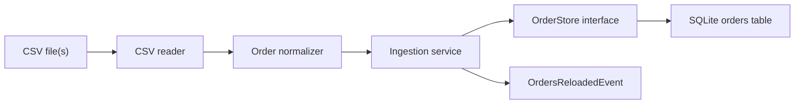

# Data module

## Responsibility

`order-data` owns the deterministic part of the system: reading CSV files,
normalizing orders, enforcing business rules, and replacing the queryable
SQLite dataset. It does not know about REST, prompts, embeddings, or Kubernetes.

## Flow in plain English

1. The executable receives `load` followed by one or more CSV paths.
2. The reader first verifies that every file exists and has all five required
   headers. A bad file fails before the database is changed.
3. Each row is normalized independently. Required identifiers are checked,
   supported date formats are parsed strictly, amounts are converted to
   `BigDecimal`, and currency rules are applied.
4. Invalid identifiers, impossible dates, and unsupported currencies become
   rejected-row issues. Missing or non-numeric amounts and missing currencies
   become defaulted-value issues.
5. Valid normalized orders from all input files are collected. If a duplicate
   ID appears despite the dataset contract, the last row wins and the event is
   reported.
6. SQLite replaces the old `orders` dataset inside one transaction. A failure
   rolls the replacement back instead of exposing half-loaded data.
7. After the transaction commits, `OrdersReloadedEvent` is published. The
   semantic-index component will later use this event to build a new index and
   swap it in without coupling AI code to the CSV reader.
8. The CLI prints an ingestion summary and row-level issues.

## Boundaries

`OrderStore` and `OrderQueryRepository` are separate write/read persistence
seams. `OrderIngestionService` and `OrderQueryService` are the inward-facing
application contracts used by the CLI and REST controller; their concrete
implementations live separately under `service.impl`. Both modules remain
inside one microservice, so these are direct Java calls rather than internal
HTTP calls.

The detailed responsibility and dependency map is in
[SOLID design](solid-design.md).

## Deliberate choices

- Monetary arithmetic uses `BigDecimal`, never floating point.
- The final USD value is the canonical stored amount. That keeps the REST and
  NL-query schema small and prevents later components from repeating conversion.
- ISO dates are bound as strings. SQLite JDBC's `setDate` stores an epoch value
  by default, which would break lexical date filters.
- The whole dataset is held in memory before replacement. This is simple and
  safe for the supplied 5,009 rows. A production-scale loader would stream into
  a staging table and transactionally swap tables.
