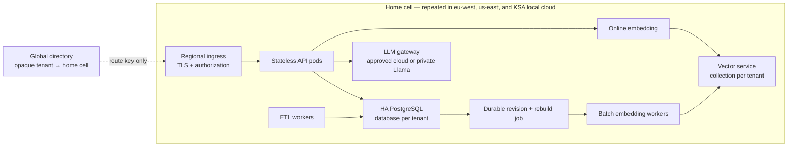

# Part 4d — Scaling OrderIQ to 50 enterprise customers

[Back to README](../README.md)

> Target state only. SQLite, its shared PVC, and the process-local vector index
> are exercise adapters; none is part of the 50-tenant runtime.

## Target-state changes from the exercise design

| Exercise implementation | Enterprise cell | Reason |
| --- | --- | --- |
| SQLite and one API replica | Regional HA PostgreSQL; database per tenant | Concurrent API replicas, recovery, and tenant isolation |
| Process-local vector index | Regional vector service; versioned tenant index | Corpus scale and non-blocking rebuilds |
| In-process rebuild | Durable job and worker pool | Recoverable cutover |
| Direct OpenAI client | Cell-local cloud/private gateway | Policy and isolation |

Tenant databases may share a regional cluster through lazy, bounded pools;
large or regulated tenants can receive a dedicated cluster or cell.

## Planning assumptions

Illustrative, not measured: 100M embeddings across 50 tenants, 10M largest.
`100M × 384 × 4 = 153.6 GB` raw; the largest uses 15.36 GB, before ANN overhead,
replicas, and rebuild copies. At 25 NL-to-SQL requests/second and two-second
latency, `25 × 2 = 50` calls are in flight. This invalidates one in-process index,
but does not select a vendor.

## Residency cells

A cell spans local fault domains. The global directory sees only an opaque key;
cached mappings survive its outage, while TLS and authorization terminate in the
cell. Data, vectors, logs, keys, and backups remain there; only a minimized
prompt may reach an approved regional provider through its gateway.

Start one cell per residency domain. Add another cell, or dedicate one to an
outlier tenant, when the tested capacity envelope cannot handle forecast peak
traffic, loss of one local fault domain, and the largest index rebuild
simultaneously. Cross-location recovery requires pre-approved, tested replication;
otherwise a location outage returns 503.

ETL atomically commits revision and rebuild job. An idempotent worker builds a
version identified by tenant, dataset revision, embedding-model version, and
document format, and activates it only if that revision is still current. The
query encoder uses the active model version. Failure leaves the old index serving;
retain one rollback, clean after retention, and isolate rebuild capacity.

## Required decisions

**Vector isolation.** The exercise's in-memory index becomes a residency-local
vector service. A shared FAISS index can reduce duplicated index metadata and
improve utilization, but raw-vector memory is similar and a missed filter can
leak data. Choose one logical index per tenant to reduce namespace-leakage risk
and simplify deletion, ownership, and rebuilds. Shared CPU/I/O/cache still need
quotas or dedicated outlier resources.

**LLM backend.** A cell-local gateway chooses the tenant-approved regional cloud
model or private Llama. The application emits one canonical query-plan contract;
adapters handle provider details. Enforce per-cell, per-tenant, and per-provider
limits, bounded queues, deadlines, and quotas; reject requests quickly when
capacity is exhausted, and attribute usage and cost by tenant and provider.
Fallback is only to a pre-approved backend in the same residency and policy
boundary.

**PII.** Resolve tenant/scope from claims before tokenization. After authorization,
domain and injection guardrails, and schema minimization, the model returns a
read-only SQL template with typed placeholders. Validate AST, objects, and limits;
bind values through prepared statements—never edit SQL text. Results stay local
and logs omit raw IDs/rows.
Cloud use requires contracted regional processing. Private Llama keeps the same
logging, retention, telemetry, and operator controls and may receive raw IDs only
when policy permits: on-premise changes the trust boundary; it does not make PII
safe.

For EU tenant `E-17`, the model sees `:customer_1`, not `DK-13375`; binding is
local. A model outage affects only `/orders/ask`; exact and semantic APIs continue.
A KSA outage returns 503—no automatic cross-region movement.

## Highest-leverage decision

Make the home cell the enforcement boundary for data, vectors, embeddings,
prompt egress, and model policy. The trade-off is duplicated capacity, lower
pooling efficiency, greater operational automation, and reduced availability
during an unreplicated location outage.
