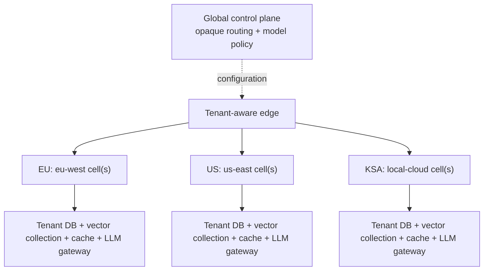

# Part 4d — Scaling OrderIQ to 50 enterprise customers

[Back to README](../README.md)

## Decision summary

Use a cell-based deployment and assign each tenant one home cell: EU tenants in
`eu-west`, US tenants in `us-east`, and KSA tenants in an approved local cloud.
A cell is a repeatable residency and failure boundary, not a synonym for one
tenant or region. Add cells within a region when measured capacity, latency, or
blast-radius thresholds require it; 50 tenants does not imply 50 clusters.

Data, embeddings, prompts, model calls, caches, and backups remain in the home
region—there is no global customer database or cache. A global control plane
holds only opaque routing and model-policy metadata. The edge authenticates and
routes; the cell reauthorizes. An unavailable home cell fails closed instead of
moving regulated data elsewhere.

## 1. Tenant isolation for the vector index

Use one vector collection per tenant inside its home cell. Collection selection
comes from the verified tenant claim, never a client-supplied tenant parameter.
A shared FAISS index saves **memory**, but one missing namespace filter creates a
**data-leakage** path. Separate collections provide predictable **latency** and
explicit deletion, encryption, backup, and audit ownership. They cost more index
overhead and reduce memory sharing. Load active encrypted snapshots on demand,
evict idle ones, and atomically swap snapshots after background rebuilds.

## 2. LLM backend per tenant

Model routing belongs in an LLM gateway inside each cell. Verified tenant policy
selects an approved regional cloud provider or a private Llama deployment.
Application code calls a model-neutral interface; adapters own provider details,
credentials, timeouts, and quotas. Prompts contain the question, schema, rules,
and output contract—not SDK types—so model changes affect policy or adapters,
not business logic.

## 3. PII in the natural-language-to-SQL flow

Authorize the tenant before prompt construction. The model receives only the
minimum question and allow-listed schema—never query results. Apply domain and
injection guardrails before the call; afterwards validate one read-only SQL
statement, enforce row/time limits, execute locally, and redact sensitive logs.

For a third-party cloud model, pseudonymize customer IDs locally and rehydrate
them before execution. Require a home-region endpoint, allow-listed private
egress, tenant credentials, and zero-training/retention terms. If policy forbids
amount or date criteria, use the private model or reject. An on-premise model may
receive raw IDs when permitted, but every other guardrail still applies.

## 4. Highest-leverage decision

The tenant's residency cell is the boundary for the database, vector index,
cache, and model execution. This decision makes residency auditable and limits
the blast radius of a failure or misconfiguration. The accepted trade-off is
duplicated regional infrastructure, lower cross-tenant utilization, and greater
operational effort than a single global platform.

## Evidence and implementation boundary

Evidence exists in the [model-neutral client](../order-ai/src/main/java/com/orderiq/client/OrderQueryModelClient.java),
[prompt factory](../order-ai/src/main/java/com/orderiq/planning/OrderQueryPromptFactory.java),
[SQL validator](../order-ai/src/main/java/com/orderiq/planning/OrderSqlValidator.java),
[atomic index](../order-ai/src/main/java/com/orderiq/semantic/InMemoryOrderSemanticIndex.java),
[rebuild manager](../order-ai/src/main/java/com/orderiq/semantic/OrderSemanticIndexManager.java),
[tests](../order-ai/src/test/java/com/orderiq/service/impl/OrderAnswerServiceImplTest.java),
and [Kubernetes deployment](../k8s/deployment.yaml). Tenant routing, storage, and
regional automation remain target-state, as Part 4d requires only their design.
