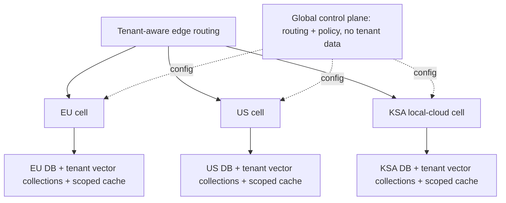

# Infrastructure and enterprise scaling

## Exercise deployment

Infrastructure is separate from the two code modules. The submission contains
one multi-stage Docker image with two process entry points, not a
cluster per Java module.

1. Gradle builds an executable `order-data` ETL JAR and an executable `order-ai`
   service JAR. `order-data` also publishes its normal library JAR to
   `order-ai` at build time.
2. The runtime image contains a Java 21 JRE and both executable JARs, runs as a
   non-root user, exposes port 8000, and defines a health check.
3. A one-replica Kubernetes `Deployment` runs the API. `/healthz` checks process
   liveness while `/readyz` prevents traffic until the semantic index is ready.
4. A `ClusterIP` Service exposes it inside the cluster.
5. A `ConfigMap` supplies non-secret settings such as the database path and
   model identifiers. Secrets come from a Kubernetes Secret or external secret
   manager, never the ConfigMap.
6. A Kubernetes `Job` uses the same image but launches the `order-data` JAR with
   `load ...`. It is a finite batch job, not a second long-running microservice.

SQLite implies one writer and, for this exercise, one API replica with persistent
storage. Claiming horizontal API scaling on a shared SQLite file would be
misleading. The enterprise design changes the persistence technology.

## Scaling to 50 residency-constrained customers

This is a cell-based deployment model, but the value is the isolation reasoning,
not an arbitrary promise of exactly three Kubernetes clusters.

1. A global control plane stores tenant-to-cell routing, model policy, feature
   flags, and deployment metadata only. It stores no orders, embeddings, prompts,
   or answer cache entries.
2. EU, US, and KSA residency cells each contain an API deployment, managed
   relational database, tenant-scoped cache, embedding workers, vector store,
   and an LLM gateway. KSA can run on the required local cloud.
3. The edge authenticates the tenant and routes the request to its home cell.
   The cell independently verifies that routing claim; a request cannot select
   a different tenant or residency region through a request parameter.
4. Tenant order databases and vector collections remain in the home cell. They
   are backed up only to approved locations within the same residency boundary.
5. There is no global order database and no global result/vector cache to sync.
   Only non-PII operational aggregates and signed configuration versions may
   flow back to the control plane.
6. Model routing lives behind a model-neutral `QueryModel` port in the cell's LLM
   gateway. Tenant policy selects an approved cloud endpoint or a private Llama
   deployment without changing prompt templates or the orchestration state
   machine.
7. Before cloud-LLM use, customer IDs are tokenized, prompts are minimized,
   provider retention/training is disabled contractually, egress is allow-listed,
   and audit logs are redacted. On-premise models still receive authorization,
   prompt-injection, SQL, logging, and output controls; residency alone is not a
   security control.

### Highest-leverage decision

Keep each tenant's database, vector collection, result cache, and model execution
inside one residency cell. This makes the security and residency boundary easy
to audit and sharply limits blast radius. The accepted trade-off is duplicated
infrastructure, lower cross-tenant utilization, and more operational work than a
single global platform.

For vector isolation, choose one logical collection/index per tenant within the
cell instead of one shared FAISS index with application-side filtering. It costs
more memory and creates more index lifecycle work, but reduces accidental
cross-tenant retrieval. Lazy loading and eviction control memory for 50 tenants.
