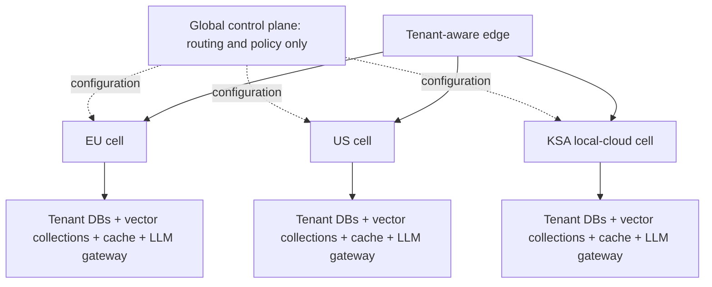

# Part 4d — Scaling OrderIQ to 50 enterprise customers

[Back to README](../README.md)

## Decision summary

Use a cell-based deployment. Assign every customer to one residency cell: EU in
`eu-west`, US in `us-east`, and KSA in an approved local cloud. Orders,
embeddings, prompts, model calls, and caches stay in that cell.

A global control plane stores routing and model policy, but no customer data.
The edge authenticates the request and routes it to the tenant's cell. The cell
verifies the tenant claim again before accessing data.

## 1. Tenant isolation for the vector index

Use one vector collection per tenant inside its home cell. A shared FAISS index
would use memory efficiently, but every search would depend on correct namespace
filtering. One missing filter could expose another customer's orders.

Separate collections make isolation, deletion, backup, and rebuilds explicit.
They also keep search latency predictable because a query scans only one
tenant's vectors. The cost is more memory and index-management work. Load active
indexes on demand, evict idle ones, and rebuild in background workers. Searches
continue on the previous immutable index until the replacement is atomically
activated.

## 2. LLM backend per tenant

Model routing belongs in an LLM gateway inside each cell. Tenant policy selects
an approved cloud provider or a private Llama deployment. Application services
call a model-neutral interface; provider adapters handle credentials, request
formats, structured output, timeouts, and rate limits.

The prompt factory produces the question, schema, read-only rules, and query-plan
structure without provider names or SDK types. Changing a tenant's model changes
routing policy, not business logic or prompt construction.

## 3. PII in the natural-language-to-SQL flow

For every model, derive tenant identity from authenticated claims, reject
unsupported or injected instructions, send only the required schema, validate
generated SQL as read-only, limit returned rows, and redact sensitive values
from operational logs.

For a third-party cloud model, tokenize customer IDs, use an approved regional
endpoint and private network path, disable provider training and retention, and
allow-list outbound destinations. An on-premise model may receive raw IDs when
policy permits, but it still requires authorization, injection checks, SQL
validation, audit controls, and retention limits. Hosting location alone is not
a security control.

## 4. Highest-leverage decision

The tenant's residency cell is the boundary for the database, vector index,
cache, and model execution. This decision makes residency auditable and limits
the blast radius of a failure or misconfiguration. The accepted trade-off is
duplicated regional infrastructure, lower cross-tenant utilization, and greater
operational effort than a single global platform.
