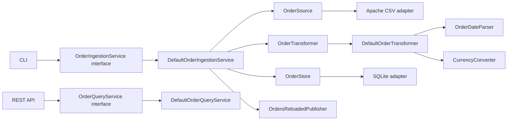

# SOLID design of `order-data`

The module uses ports and adapters to apply SOLID where it creates a real
substitution boundary. It does not add interfaces to immutable value objects or
other classes that have no alternative behavior.



## Single responsibility

- `CsvOrderReader` extracts and validates CSV structure only. It does not apply
  order business rules or write to a database.
- `DefaultOrderTransformer` coordinates transformation of one raw row only.
- `FlexibleOrderDateParser` owns supported date formats.
- `FixedRateCurrencyConverter` owns exchange-rate lookup and conversion.
- `DefaultOrderIngestionService` coordinates a load use case; persistence and
  event publication are delegated to ports.
- SQLite classes perform database operations only.

## Open/closed

New file formats implement `OrderSource`; new date policies implement
`OrderDateParser`; new rate providers implement `CurrencyConverter`; and a new
database implements the read/write ports. None requires modifying the ingestion
or query use case. `DefaultOrderTransformerTest` demonstrates adding dotted
dates and GBP conversion entirely through injected policies.

## Liskov substitution

Each port has a behavioral contract expressed in domain types. Tests replace
the durable store and event publisher with in-memory implementations without
changing the use case. Infrastructure implementations return the same immutable
`Order`, `IngestionReport`, and `OrderStatistics` types.

## Interface segregation

The interfaces are deliberately narrow:

- `OrderIngestionService` is the CLI-facing command contract.
- `OrderQueryService` is the REST-facing read contract.
- `OrderTransformer` is the row-transformation contract.
- `OrderSource` only extracts rows.
- `OrderStore` only replaces normalized orders.
- `OrderQueryRepository` only performs required reads.
- `OrdersReloadedPublisher` only announces a completed reload.

The API is not forced to depend on ingestion, and the CLI is not forced to
depend on query operations.

## Dependency inversion

Application services import no Spring, SQLite, or Apache CSV types. They depend
on the ports above. `OrderDataConfiguration` is the composition root that binds
those abstractions to Apache CSV, SQLite, Spring events, a UTC clock, and the
exercise's fixed exchange rates.

This boundary also protects Part 4: semantic indexing subscribes to the reload
event port and AI querying consumes read ports, without reaching into CSV or
SQLite implementation details.

## Package ownership

```text
com.orderiq.data
├── model              immutable domain and result models
├── service            application contracts
│   └── impl           application implementations
├── policy             replaceable business policies
│   └── impl           current policy implementations
├── port                external dependency contracts
├── adapter
│   ├── csv             CSV input adapter
│   └── sqlite          SQLite persistence adapters
├── exception           domain/application failures
└── config              Spring composition root
```

Models contain data and invariants, services orchestrate use cases, policies
encapsulate variable business behavior, ports define what the core needs from
the outside, and adapters implement those ports. `service.impl` remains plain
Java and does not import Spring, CSV, or SQLite libraries.
